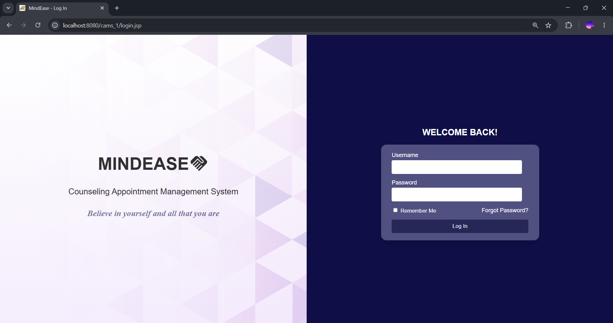
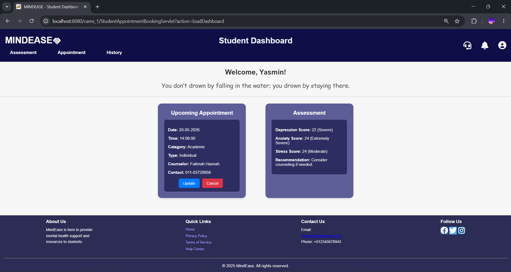
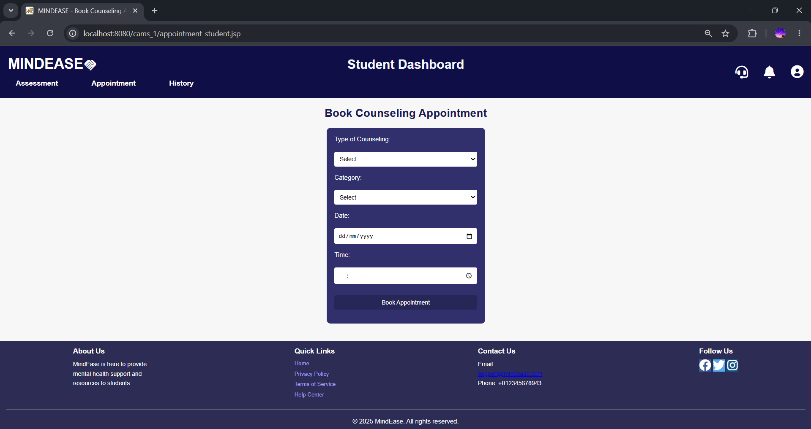
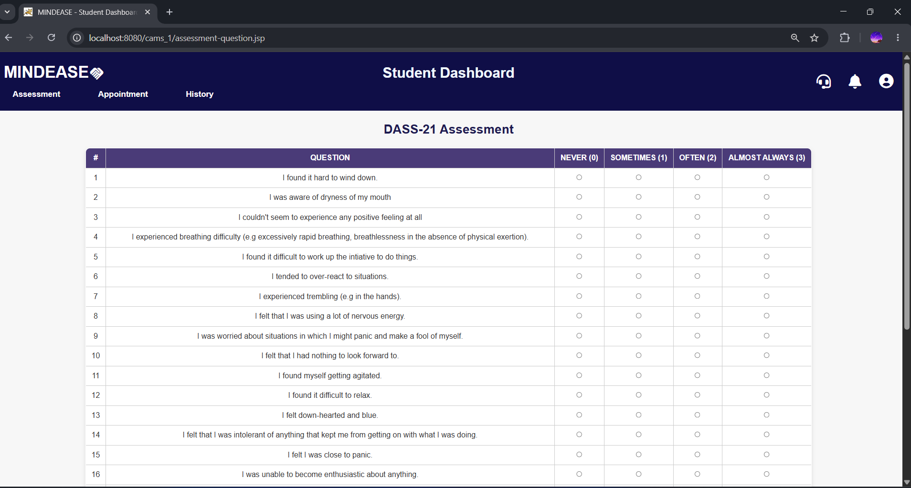
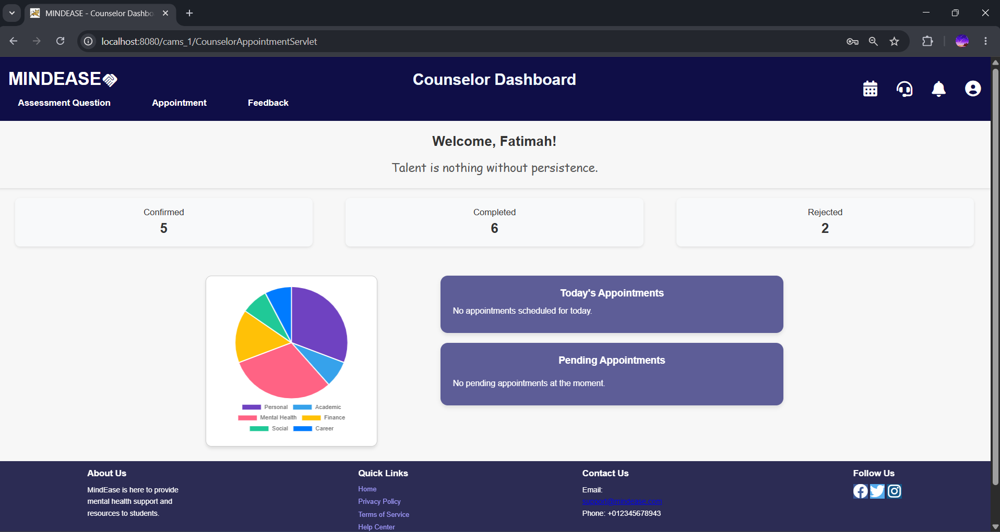
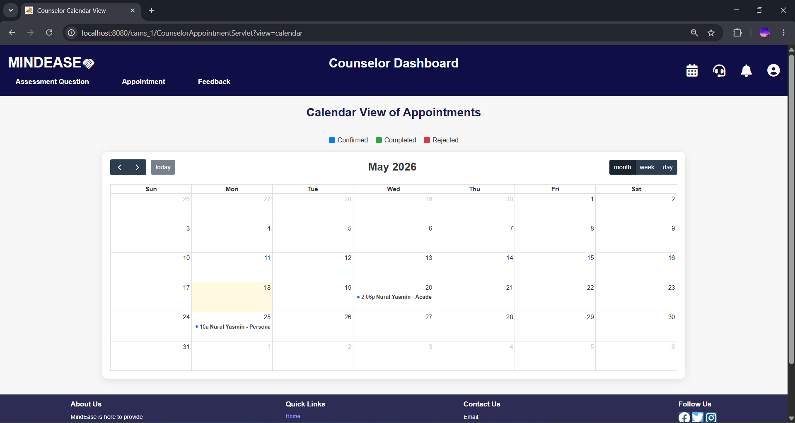
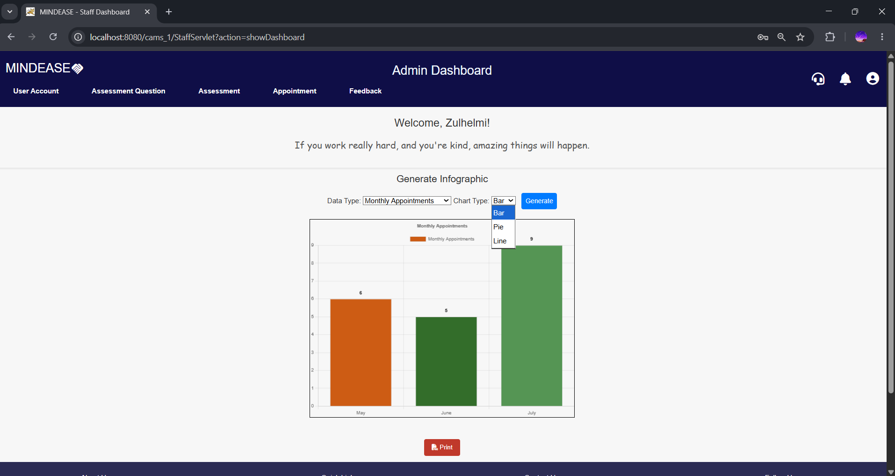

# CAMS – Counseling Appointment Management System

## Project Overview

CAMS (Counseling Appointment Management System) is a web-based system developed to improve and streamline counseling services for students at Universiti Malaysia Terengganu (UMT).

The system digitalizes the counseling appointment process by allowing students to:
- book counseling appointments online
- complete mental health assessments
- receive appointment notifications
- view appointment history

The system also assists counselors and HEPA (Hal Ehwal Pelajar & Alumni) staff in managing appointments, monitoring student progress, and generating reports more efficiently.

This project was developed as my Final Year Project (FYP) during my Bachelor's Degree in Software Engineering.

---

## Technologies Used

### Backend
- Java Servlet
- JSP (JavaServer Pages)
- Apache Tomcat

### Frontend
- HTML
- CSS
- JavaScript
- Bootstrap

### Database
- MySQL

### APIs & Services
- Google Calendar API
- Jakarta Mail API

### Development Tools
- Apache NetBeans
- XAMPP

---

## Main Features

### Student Module
- User registration and login
- Book counseling appointments
- Mental health assessment
- Appointment history
- Feedback submission

### Counselor Module
- Manage counseling appointments
- Update appointment status
- View student appointment details
- Generate referral PDF

### Staff Module
- Manage counseling data
- View reports and analytics
- Monitor system usage

### System Features
- Email notification system
- Google Calendar integration
- Role-based authentication
- Appointment auto-assignment

---

## System Screenshots

### Login Page

### Student Dashboard

### Appointment Booking

### Mental Health Assessment

### Counselor Dashboard

### Google Calendar

### Report Dashboard

---

## Installation Guide

### Prerequisites
- Apache NetBeans
- XAMPP
- Apache Tomcat
- JDK 8 or above
- MySQL

### Setup Steps

1. Clone the repository
   '''bash
   git clone your-repository-link
2. Import the project into Apache NetBeans
3. Import the database file: database/cams1.sql
4. Configure the database connection and API credentials inside: WEB-INF/config.example.properties
5. Run the project using Apache Tomcat

---

## Important Note
Sensitive files such as API credentials, email password, and Google service account keys are excluded from this repository for security purposes.
Use: config.example.properties
as a reference to create your own local configuration.

---

## Author

- Developed by Nurul Yasmin
- Bachelor of Computer Science (Software Engineering)
- Currently exploring and growing in the world of software development and technology
